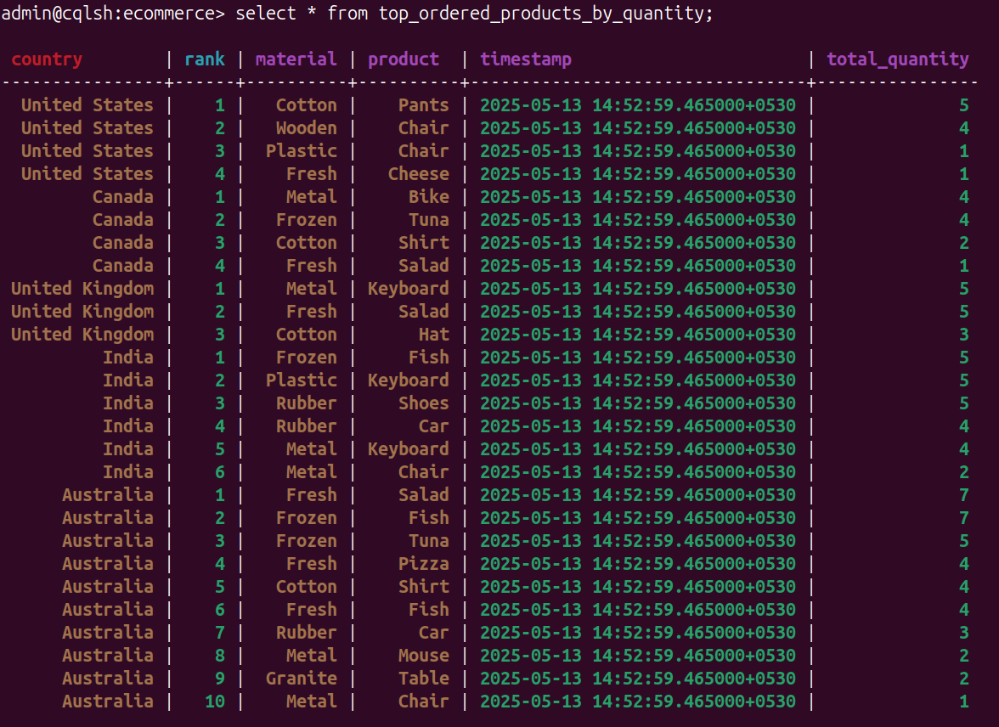
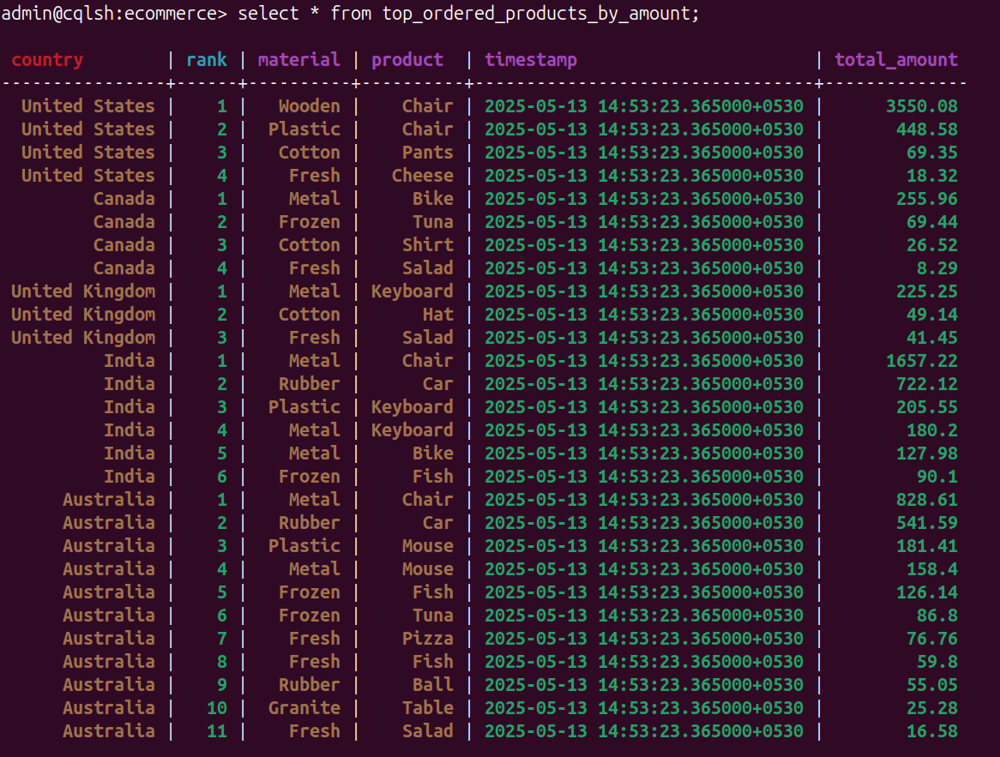

# 🛒 Real-Time Top Ordered Products Stream

This project performs **real-time streaming analytics** to compute and display:

- 📦 Top ordered products by **quantity**
- 💰 Top ordered products by **revenue**

It ingests live customer order data, processes it in real time using Apache Kafka and PySpark Streaming, and stores the aggregated results for further consumption.

## 🚀 Features

- Real-time ingestion of order data via Kafka
- Kafka producer is triggered by Apache Airflow on a schedule to create the customer order
- Source data fetched from **MySQL**
- Live aggregation of product sales using **PySpark Streaming**:
  - Top products by **quantity sold**
  - Top products by **total revenue**
- Sliding window support for near real-time ranking
- Aggregated results stored in **Cassandra** for fast access

## 🧱 Tech Stack

- **Language**: Python
- **Stream Processor**: Apache Kafka & PySpark Streaming
- **Source Database**: MySQL
- **Target Store**: Cassandra
- **Orchestration**: Apache Airflow
- **Optional Components**:
  - **Docker**: For containerized services
  - **FastAPI**: To simulate microservices

## 🗃️ Cassandra Output Preview

Below is a screenshot of the aggregated results stored in Cassandra after processing the streaming data:

